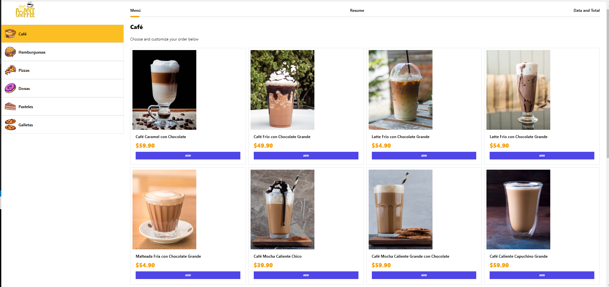
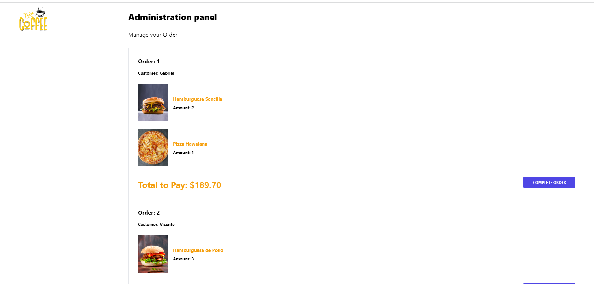

<div align="center">
  
  <h3><b>Kiosk App</b></h3>
  

  

   

  <br/>

</div>

# 📗 Table of Contents <a name="table-of-contents"></a>

- [📗 Table of Contents](#-table-of-contents-)
- [📖 About the Project](#-about-the-project-)
  - [🚀 Live Demo ](#-live-demo-)
  - [🛠 Built With](#-built-with-)
    - [Tech Stack](#tech-stack-)
    - [Key Features](#key-features-)
  - [🚀 Getting Started](#-getting-started-)
    - [Prerequisites](#prerequisites)
    - [Setup](#setup)
    - [Install](#install)
    - [Usage](#usage)
  - [👥 Authors](#-authors-)
  - [🤝 Contributing](#-contributing-)
  - [📝 License](#-license-)

<!-- PROJECT DESCRIPTION -->

# 📖 About the Project <a name="about-project"></a>

**Kiosk App** is a comprehensive application developed using Next.js, Prisma, Tailwind CSS, SWR, and MySQL. It serves as a kiosk solution with a client-side interface for placing orders and a server-side system to manage and fulfill those orders. The app ensures a seamless user experience, real-time updates, and efficient data handling.

🛒 Users can place orders, receive order confirmation, and track the preparation process. The system calculates the total amount to be paid and provides a streamlined process from order placement to delivery.

This app was created as part of the course "React - The Complete Guide: Hooks Context Redux MERN +15 Apps"! 

<!-- LIVE DEMO -->

## 🚀 Live Demo <a name="live-demo"></a>

- [Live Demo](https://kioskapp-nextjs-production.up.railway.app/)
- [Live Demo Admin](https://kioskapp-nextjs-production.up.railway.app/admin)


<p align="right">(<a href="#readme-top">back to top</a>)</p>

## 🛠 Built With <a name="built-with"></a>

### Tech Stack <a name="tech-stack"></a>

<details>
  <summary>Front-end</summary>
  <ul>
    <li><a href="https://nextjs.org/">Next.js</a></li>
    <li><a href="https://tailwindcss.com/">Tailwind CSS</a></li>
  </ul>
</details>

<details>
  <summary>Back-end</summary>
  <ul>
    <li><a href="https://prisma.io/">Prisma</a></li>
  </ul>
</details>

# 🚀 Getting Started <a name="getting-started"></a>

To get a local copy up and running, follow these steps.

### Setup

1. Clone this repository to your desired folder:

```sh
git clone https://github.com/cilfonegabriel/kioskapp-nextjs.git
cd kioskapp-nextjs

### Install

After cloning the repo, navigate into it and install all the required packages with the following command:

```sh

npm install

```

Then just wait for everything to finish downloading.

### Usage

Start the React app:

`npm run dev`

Runs the app in the development mode.\
Open [http://localhost:3000](http://localhost:3000) to view it in your browser.

The page will reload when you make changes.\
You may also see any lint errors in the console.

`npm run eject`

### Deployment

You can deploy this project using:

`npm run build`

Builds the app for production to the `build` folder.\
It correctly bundles React in production mode and optimizes the build for the best performance.

The build is minified and the filenames include the hashes.\
Your app is ready to be deployed!

See the section about [deployment](https://facebook.github.io/create-react-app/docs/deployment) for more information.

<p align="right">(<a href="#readme-top">back to top</a>)</p>

<!-- AUTHORS -->

## 👥 Authors <a name="authors"></a>

👤 **Gabriel -Cilfone**
- GitHub: [Gabriel Cilfone](https://github.com/cilfonegabriel)
- LinkedIn: [Gabriel Cilfone](www.linkedin.com/in/gabriel-cilfone/)

<p align="right">(<a href="#readme-top">back to top</a>)</p>

<!-- FUTURE FEATURES -->

## 🔭 API Endpoints <a name="API-Endpoints"></a>

- [ ] **http://localhost:3000**
- [ ] **http://localhost:3000/admin**
- [ ] **http://localhost:3000/api/product**
- [ ] **http://localhost:3000/api/category**
- [ ] **http://localhost:3000/api/orders**

<p align="right">(<a href="#readme-top">back to top</a>)</p>

<!-- CONTRIBUTING -->

## 🤝 Contributing <a name="contributing"></a>

Contributions, issues, and feature requests are welcome!

Feel free to check the [issues page](https://github.com/cilfonegabriel/kioskapp-nextjs/issues).

<p align="right">(<a href="#readme-top">back to top</a>)</p>

<!-- SUPPORT -->

<p align="right">(<a href="#readme-top">back to top</a>)</p>

<!-- ACKNOWLEDGEMENTS -->

## 🙏 Acknowledgments <a name="acknowledgements"></a>

- Thanks to Microverse and all my teammates!

<p align="right">(<a href="#readme-top">back to top</a>)</p>

## 📝 License <a name="license"></a>

This project is [MIT](./LICENSE) licensed.

<p align="right">(<a href="#readme-top">back to top</a>)</p>
